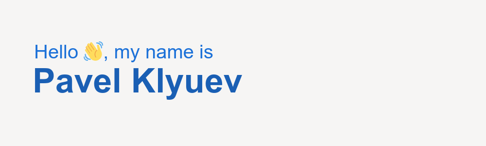

# About me
The beginning of Kuberty // SRE at [Leroy Merlin](https://github.com/adeo)

Evil genius // Toxic single-minded // Digital addicted

### Main skills

### Top langs

   

### Tools I'm using

### Contacts

<!--
**pashtet04/pashtet04** is a ✨ _special_ ✨ repository because its `README.md` (this file) appears on your GitHub profile.

Here are some ideas to get you started:

- 🔭 I’m currently working on ...
- 🌱 I’m currently learning ...
- 👯 I’m looking to collaborate on ...
- 🤔 I’m looking for help with ...
- 💬 Ask me about ...
- 📫 How to reach me: ...
- 😄 Pronouns: ...
- ⚡ Fun fact: ...
-->
